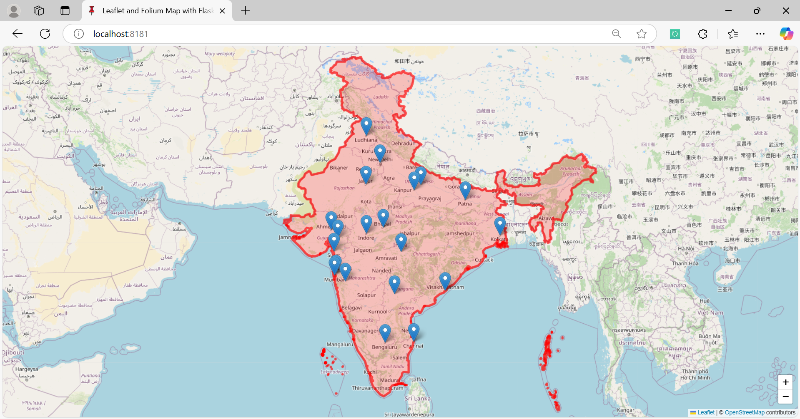
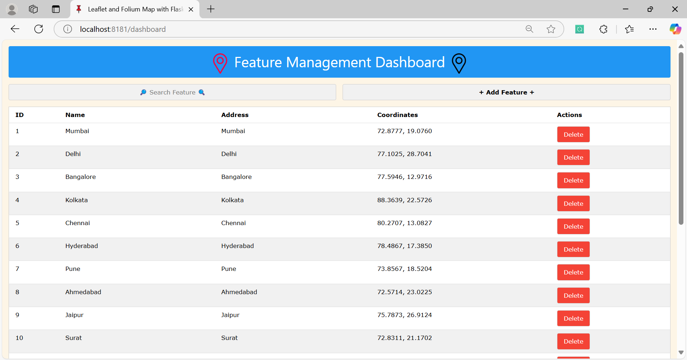

# Smart City Mapper

**Smart City Mapper** is an interactive map application that allows users to manage features (such as cities, landmarks, etc.) on a real-time updating Leaflet map. The map updates dynamically using WebSockets for a seamless experience, where users can add, update, and delete city data with instant reflection on the map.

## Features

- **Interactive Map**: Powered by Leaflet.js, the map displays features with real-time updates.
- **Real-Time Updates**: Uses WebSockets (via Flask-SocketIO) to update the map instantly when features are added or removed.
- **Add/Remove Features**: Admin dashboard allows users to add new features, such as cities, with relevant details (name, address, latitude, longitude).
- **Beautiful UI**: The dashboard and map are designed with a clean and modern interface.
- **Responsive**: Works across devices and screen sizes.

## Technologies Used

- **Backend**: Flask, Flask-SocketIO, Eventlet
- **Frontend**: Leaflet.js, HTML, CSS (W3.CSS)
- **Database**: TinyDB (NoSQL for storing city data with auto-increment primary keys)

## Installation

### Prerequisites

Before you begin, ensure you have the following installed:
- Python 3.x

### Step 1: Clone the repository

```bash
git clone https://github.com/jeetendra29gupta/smart-city-mapper.git
cd smart-city-mapper
```

### Step 2: Install Python dependencies

```bash
pip install -r requirements.txt
```

### Step 4: Run the Application

Run the Flask application:

```bash
python main_app.py
```

The index page will be available at `http://127.0.0.1:8181/`.


## Usage

### Dashboard

The dashboard will be available at `http://127.0.0.1:8181/dashboard`.


1. Visit the **Dashboard** page to view, add, and delete city features.
2. **Add Feature**: Fill in the city details (name, address, latitude, longitude) and click on "Submit Form".
3. **Delete Feature**: Each city on the list has a "Delete" button to remove it from the map.
4. Changes are updated in real-time on the interactive map.

### Map Page

1. The **Map** page will show the updated features as they are added or removed from the dashboard.
2. Each feature on the map can be clicked to display a popup with more details like the name and address.

## Example Data

Here are the first 20 cities of India to get you started with the data:

```json
[
    { "name": "Mumbai", "latitude": 19.0760, "longitude": 72.8777 },
    { "name": "Delhi", "latitude": 28.7041, "longitude": 77.1025 },
    { "name": "Bangalore", "latitude": 12.9716, "longitude": 77.5946 },
    { "name": "Kolkata", "latitude": 22.5726, "longitude": 88.3639 },
    { "name": "Chennai", "latitude": 13.0827, "longitude": 80.2707 },
    { "name": "Hyderabad", "latitude": 17.3850, "longitude": 78.4867 },
    { "name": "Pune", "latitude": 18.5204, "longitude": 73.8567 },
    { "name": "Ahmedabad", "latitude": 23.0225, "longitude": 72.5714 },
    { "name": "Jaipur", "latitude": 26.9124, "longitude": 75.7873 },
    { "name": "Surat", "latitude": 21.1702, "longitude": 72.8311 },
    { "name": "Lucknow", "latitude": 26.8467, "longitude": 80.9462 },
    { "name": "Kanpur", "latitude": 26.4499, "longitude": 80.3319 },
    { "name": "Nagpur", "latitude": 21.1458, "longitude": 79.0882 },
    { "name": "Indore", "latitude": 22.7196, "longitude": 75.8577 },
    { "name": "Thane", "latitude": 19.2183, "longitude": 72.9780 },
    { "name": "Bhopal", "latitude": 23.2599, "longitude": 77.4126 },
    { "name": "Visakhapatnam", "latitude": 17.6868, "longitude": 83.2185 },
    { "name": "Vadodara", "latitude": 22.3072, "longitude": 73.1812 },
    { "name": "Patna", "latitude": 25.5941, "longitude": 85.1376 },
    { "name": "Ludhiana", "latitude": 30.9000, "longitude": 75.8573 }
]
```
---